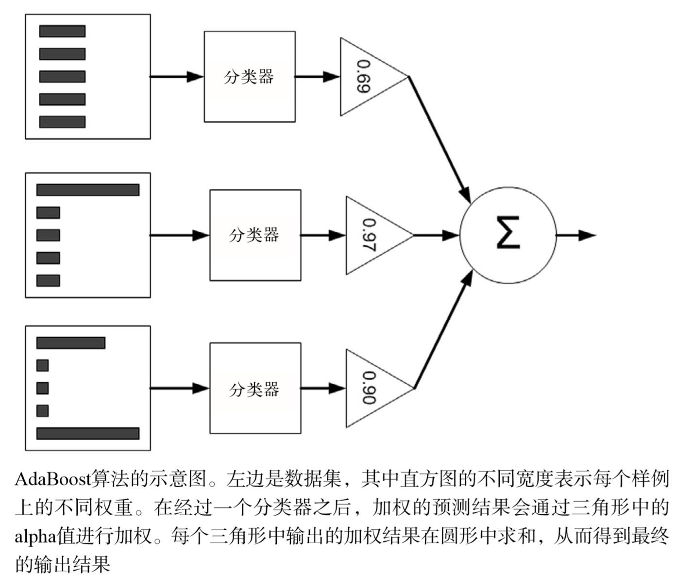

@(机器学习)

### AdaBoost算法

AdaBoost算法使用多个弱分类器构建一个强分类器。

**算法流程**：
* 给训练数据中的每一个样本赋予一个权重，这些权重构成了一个向量D。
* 首先在这些数据上训练出一个弱分类器。
* 这里能产生多个弱分类器，但是我们选择**weightError**最小的，假如弱分类器对样本预测的错误标记为**errorLabel**，正确标记为0，错误为1。那么：
$$
weightError = sum(D*errorLabel)
$$

* 计算分类器的错误率$\varepsilon$，$\varepsilon$的定义如下：
$$
\varepsilon = \frac{未正确分类的样本数目}{所有样本数}
$$
* 为分类器分配一个权重值$\alpha$，$\alpha$定义如下：
$$
\alpha = \frac{1}{2}ln(\frac{1-e}{e})
$$
* 更新权重向量D，被正确分类的样本权重会降低，被错误分类的样本权重会增加：
如果样本被正确分类
$$
D_{i}^{t+1} = \frac{D_{i}^{t}e^{-\alpha}}{sum(D)}
$$
如果样本被错误分类
$$
D_{i}^{t+1} = \frac{D_{i}^{t}e^{\alpha}}{sum(D)}
$$
* 继续在数据集上训练弱分类器，这个时候算法会选择一个怎么样的分类器呢？会选择一个尽可能将上一次被分类错误的样本，分类正确的分类器，因为**D和weightError**。
* 重复上述步骤，训练足够的分类器或者错误率达到0（弱分类器的个数是一个超参数）。

下图是多个弱分类器预测样本结果的一个流程：

